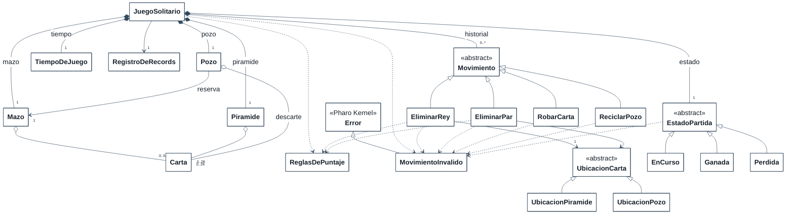

# Diagrama de clases simplificado — SolitarioPiramide-Modelo

```mermaid
%%{init: {
    "theme": "base",
    "themeVariables": {
        "fontFamily": "Arial",
        "fontSize": "20px",
        "primaryColor": "#FFFFFF",
        "primaryTextColor": "#17202A",
        "primaryBorderColor": "#34495E",
        "lineColor": "#34495E",
        "background": "#FFFFFF",
        "edgeLabelBackground": "#FFFFFF"
    },
    "class": {
        "hideEmptyMembersBox": true
    }
}}%%

classDiagram
    direction TB

    %% Clases principales
    class JuegoSolitario
    class Carta
    class Mazo
    class Piramide
    class Pozo
    class TiempoDeJuego
    class ReglasDePuntaje
    class RegistroDeRecords
    class MovimientoInvalido

    class Error {
        <<Pharo Kernel>>
    }

    %% Jerarquia de ubicaciones
    class UbicacionCarta {
        <<abstract>>
    }

    class UbicacionPiramide
    class UbicacionPozo

    %% Jerarquia de estados
    class EstadoPartida {
        <<abstract>>
    }

    class EnCurso
    class Ganada
    class Perdida

    %% Jerarquia de movimientos
    class Movimiento {
        <<abstract>>
    }

    class EliminarRey
    class EliminarPar
    class RobarCarta
    class ReciclarPozo

    %% Herencias
    Error <|-- MovimientoInvalido

    UbicacionCarta <|-- UbicacionPiramide
    UbicacionCarta <|-- UbicacionPozo

    EstadoPartida <|-- EnCurso
    EstadoPartida <|-- Ganada
    EstadoPartida <|-- Perdida

    Movimiento <|-- EliminarRey
    Movimiento <|-- EliminarPar
    Movimiento <|-- RobarCarta
    Movimiento <|-- ReciclarPozo

    %% Composiciones y asociaciones principales
    JuegoSolitario *-- "1" Mazo : mazo
    JuegoSolitario *-- "1" Piramide : piramide
    JuegoSolitario *-- "1" Pozo : pozo
    JuegoSolitario *-- "1" TiempoDeJuego : tiempo
    JuegoSolitario *-- "1" EstadoPartida : estado
    JuegoSolitario *-- "0..*" Movimiento : historial
    JuegoSolitario --> "1" RegistroDeRecords
    JuegoSolitario ..> ReglasDePuntaje
    JuegoSolitario ..> MovimientoInvalido

    %% Relaciones de las cartas
    Mazo o-- "0..52" Carta
    Piramide o-- "0..28" Carta
    Pozo --> "1" Mazo : reserva
    Pozo o-- "0..24" Carta : descarte

    %% Relaciones de los movimientos
    EliminarRey --> "1" UbicacionCarta
    EliminarPar --> "2" UbicacionCarta

    EliminarRey ..> ReglasDePuntaje
    EliminarPar ..> ReglasDePuntaje

    EliminarRey ..> MovimientoInvalido
    EliminarPar ..> MovimientoInvalido
    RobarCarta ..> MovimientoInvalido
    ReciclarPozo ..> MovimientoInvalido
    EstadoPartida ..> MovimientoInvalido

    %% Definicion de estilos
    classDef principal fill:#DCE8F5,stroke:#34495E,stroke-width:2px,color:#17202A
    classDef dominio fill:#FFFFFF,stroke:#566573,color:#17202A
    classDef estados fill:#E8F3E8,stroke:#527A52,color:#17202A
    classDef movimientos fill:#E4EDF9,stroke:#5276A5,color:#17202A
    classDef ubicaciones fill:#FFF1D9,stroke:#A68A4E,color:#17202A
    classDef errores fill:#F8E5E5,stroke:#A65C5C,color:#17202A

    %% Clase coordinadora
    cssClass "JuegoSolitario" principal

    %% Entidades y servicios del dominio
    cssClass "Carta" dominio
    cssClass "Mazo" dominio
    cssClass "Piramide" dominio
    cssClass "Pozo" dominio
    cssClass "TiempoDeJuego" dominio
    cssClass "ReglasDePuntaje" dominio
    cssClass "RegistroDeRecords" dominio

    %% Estados
    cssClass "EstadoPartida" estados
    cssClass "EnCurso" estados
    cssClass "Ganada" estados
    cssClass "Perdida" estados

    %% Movimientos
    cssClass "Movimiento" movimientos
    cssClass "EliminarRey" movimientos
    cssClass "EliminarPar" movimientos
    cssClass "RobarCarta" movimientos
    cssClass "ReciclarPozo" movimientos

    %% Ubicaciones
    cssClass "UbicacionCarta" ubicaciones
    cssClass "UbicacionPiramide" ubicaciones
    cssClass "UbicacionPozo" ubicaciones

    %% Excepciones
    cssClass "Error" errores
    cssClass "MovimientoInvalido" errores
```

