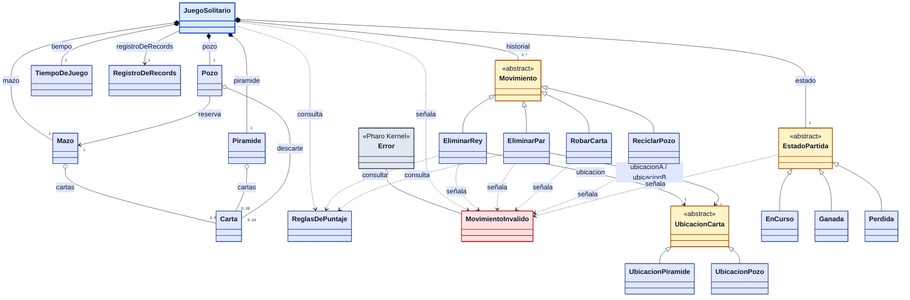

```mermaid
%%{init: {
  'theme': 'base',
  'themeVariables': {
    'fontSize': '20px',
    'primaryColor': '#e0e7ff',
    'primaryTextColor': '#0f172a',
    'primaryBorderColor': '#1e3a8a',
    'lineColor': '#0f172a',
    'secondaryColor': '#fef3c7',
    'tertiaryColor': '#f1f5f9'
  },
  'themeCSS': 'g.classGroup text { font-size: 20px !important; font-weight: 700 !important; fill: #0f172a !important; } g.classGroup rect { fill: #f8fafc !important; stroke: #1e293b !important; stroke-width: 2px !important; } .edgeLabel, .edgeLabel text, .edgeLabel span, .relationshipLabel, .relationshipLabel text { font-size: 18px !important; font-weight: 700 !important; fill: #0f172a !important; color: #0f172a !important; background-color: #ffffff !important; }'
}}%%
classDiagram
    direction TB

    class JuegoSolitario
    class Carta
    class Mazo
    class Piramide
    class Pozo
    class TiempoDeJuego
    class ReglasDePuntaje
    class RegistroDeRecords
    class MovimientoInvalido

    class Error {
        <<Pharo Kernel>>
    }

    class UbicacionCarta {
        <<abstract>>
    }
    class UbicacionPiramide
    class UbicacionPozo

    class EstadoPartida {
        <<abstract>>
    }
    class EnCurso
    class Ganada
    class Perdida

    class Movimiento {
        <<abstract>>
    }
    class EliminarRey
    class EliminarPar
    class RobarCarta
    class ReciclarPozo

    style JuegoSolitario fill:#dbeafe,stroke:#1d4ed8,stroke-width:2.5px,color:#0f172a
    style MovimientoInvalido fill:#fee2e2,stroke:#b91c1c,stroke-width:2px,color:#0f172a
    style Error fill:#e2e8f0,stroke:#334155,stroke-width:2px,color:#0f172a
    style UbicacionCarta fill:#fef3c7,stroke:#b45309,stroke-width:2px,color:#0f172a
    style EstadoPartida fill:#fef3c7,stroke:#b45309,stroke-width:2px,color:#0f172a
    style Movimiento fill:#fef3c7,stroke:#b45309,stroke-width:2px,color:#0f172a

    %% Herencias
    Error <|-- MovimientoInvalido
    UbicacionCarta <|-- UbicacionPiramide
    UbicacionCarta <|-- UbicacionPozo
    EstadoPartida <|-- EnCurso
    EstadoPartida <|-- Ganada
    EstadoPartida <|-- Perdida
    Movimiento <|-- EliminarRey
    Movimiento <|-- EliminarPar
    Movimiento <|-- RobarCarta
    Movimiento <|-- ReciclarPozo

    %% Composiciones, agregaciones, asociaciones y dependencias con cardinalidad
    JuegoSolitario *-- "1" Mazo : mazo
    JuegoSolitario *-- "1" Piramide : piramide
    JuegoSolitario *-- "1" Pozo : pozo
    JuegoSolitario *-- "1" TiempoDeJuego : tiempo
    JuegoSolitario *-- "1" EstadoPartida : estado
    JuegoSolitario *-- "0..*" Movimiento : historial
    JuegoSolitario --> "1" RegistroDeRecords : registroDeRecords
    JuegoSolitario ..> ReglasDePuntaje : consulta
    JuegoSolitario ..> MovimientoInvalido : señala

    Mazo o-- "0..52" Carta : cartas
    Piramide o-- "0..28" Carta : cartas
    Pozo --> "1" Mazo : reserva
    Pozo o-- "0..24" Carta : descarte

    EliminarRey --> "1" UbicacionCarta : ubicacion
    EliminarPar --> "2" UbicacionCarta : ubicacionA / ubicacionB
    EliminarRey ..> ReglasDePuntaje : consulta
    EliminarPar ..> ReglasDePuntaje : consulta
    EliminarRey ..> MovimientoInvalido : señala
    EliminarPar ..> MovimientoInvalido : señala
    RobarCarta ..> MovimientoInvalido : señala
    ReciclarPozo ..> MovimientoInvalido : señala
    EstadoPartida ..> MovimientoInvalido : señala
```
