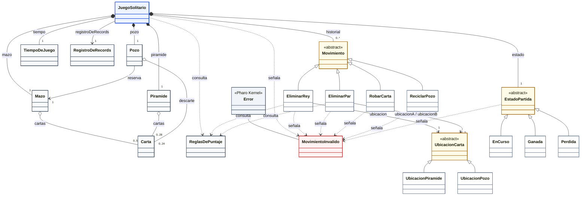

```mermaid
classDiagram
    direction TB

    class JuegoSolitario
    class Carta
    class Mazo
    class Piramide
    class Pozo
    class TiempoDeJuego
    class ReglasDePuntaje
    class RegistroDeRecords
    class MovimientoInvalido

    class Error {
        <<Pharo Kernel>>
    }

    class UbicacionCarta {
        <<abstract>>
    }
    class UbicacionPiramide
    class UbicacionPozo

    class EstadoPartida {
        <<abstract>>
    }
    class EnCurso
    class Ganada
    class Perdida

    class Movimiento {
        <<abstract>>
    }
    class EliminarRey
    class EliminarPar
    class RobarCarta
    class ReciclarPozo

    %% Estilos para resaltar las cajas
    style JuegoSolitario fill:#eef4ff,stroke:#1d4ed8,stroke-width:2px
    style Carta fill:#f8fafc,stroke:#334155,stroke-width:1.5px
    style Mazo fill:#f8fafc,stroke:#334155,stroke-width:1.5px
    style Piramide fill:#f8fafc,stroke:#334155,stroke-width:1.5px
    style Pozo fill:#f8fafc,stroke:#334155,stroke-width:1.5px
    style TiempoDeJuego fill:#f8fafc,stroke:#334155,stroke-width:1.5px
    style ReglasDePuntaje fill:#f8fafc,stroke:#334155,stroke-width:1.5px
    style RegistroDeRecords fill:#f8fafc,stroke:#334155,stroke-width:1.5px
    style MovimientoInvalido fill:#fef2f2,stroke:#b91c1c,stroke-width:1.5px
    style Error fill:#f1f5f9,stroke:#475569,stroke-width:1.5px

    style UbicacionCarta fill:#fefce8,stroke:#a16207,stroke-width:1.5px
    style UbicacionPiramide fill:#ffffff,stroke:#64748b,stroke-width:1.5px
    style UbicacionPozo fill:#ffffff,stroke:#64748b,stroke-width:1.5px

    style EstadoPartida fill:#fefce8,stroke:#a16207,stroke-width:1.5px
    style EnCurso fill:#ffffff,stroke:#64748b,stroke-width:1.5px
    style Ganada fill:#ffffff,stroke:#64748b,stroke-width:1.5px
    style Perdida fill:#ffffff,stroke:#64748b,stroke-width:1.5px

    style Movimiento fill:#fefce8,stroke:#a16207,stroke-width:1.5px
    style EliminarRey fill:#ffffff,stroke:#64748b,stroke-width:1.5px
    style EliminarPar fill:#ffffff,stroke:#64748b,stroke-width:1.5px
    style RobarCarta fill:#ffffff,stroke:#64748b,stroke-width:1.5px
    style ReciclarPozo fill:#ffffff,stroke:#64748b,stroke-width:1.5px

    %% Herencias
    Error <|-- MovimientoInvalido
    UbicacionCarta <|-- UbicacionPiramide
    UbicacionCarta <|-- UbicacionPozo
    EstadoPartida <|-- EnCurso
    EstadoPartida <|-- Ganada
    EstadoPartida <|-- Perdida
    Movimiento <|-- EliminarRey
    Movimiento <|-- EliminarPar
    Movimiento <|-- RobarCarta
    Movimiento <|-- ReciclarPozo

    %% Composiciones, agregaciones, asociaciones y dependencias con cardinalidad
    JuegoSolitario *-- "1" Mazo : mazo
    JuegoSolitario *-- "1" Piramide : piramide
    JuegoSolitario *-- "1" Pozo : pozo
    JuegoSolitario *-- "1" TiempoDeJuego : tiempo
    JuegoSolitario *-- "1" EstadoPartida : estado
    JuegoSolitario *-- "0..*" Movimiento : historial
    JuegoSolitario --> "1" RegistroDeRecords : registroDeRecords
    JuegoSolitario ..> ReglasDePuntaje : consulta
    JuegoSolitario ..> MovimientoInvalido : señala

    Mazo o-- "0..52" Carta : cartas
    Piramide o-- "0..28" Carta : cartas
    Pozo --> "1" Mazo : reserva
    Pozo o-- "0..24" Carta : descarte

    EliminarRey --> "1" UbicacionCarta : ubicacion
    EliminarPar --> "2" UbicacionCarta : ubicacionA / ubicacionB
    EliminarRey ..> ReglasDePuntaje : consulta
    EliminarPar ..> ReglasDePuntaje : consulta
    EliminarRey ..> MovimientoInvalido : señala
    EliminarPar ..> MovimientoInvalido : señala
    RobarCarta ..> MovimientoInvalido : señala
    ReciclarPozo ..> MovimientoInvalido : señala
    EstadoPartida ..> MovimientoInvalido : señala
```
