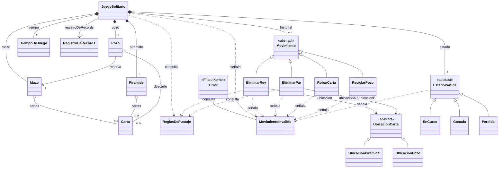

```mermaid
classDiagram
    direction TB

    class JuegoSolitario
    class Carta
    class Mazo
    class Piramide
    class Pozo
    class TiempoDeJuego
    class ReglasDePuntaje
    class RegistroDeRecords
    class MovimientoInvalido

    class Error {
        <<Pharo Kernel>>
    }

    class UbicacionCarta {
        <<abstract>>
    }
    class UbicacionPiramide
    class UbicacionPozo

    class EstadoPartida {
        <<abstract>>
    }
    class EnCurso
    class Ganada
    class Perdida

    class Movimiento {
        <<abstract>>
    }
    class EliminarRey
    class EliminarPar
    class RobarCarta
    class ReciclarPozo

    %% Herencias
    Error <|-- MovimientoInvalido
    UbicacionCarta <|-- UbicacionPiramide
    UbicacionCarta <|-- UbicacionPozo
    EstadoPartida <|-- EnCurso
    EstadoPartida <|-- Ganada
    EstadoPartida <|-- Perdida
    Movimiento <|-- EliminarRey
    Movimiento <|-- EliminarPar
    Movimiento <|-- RobarCarta
    Movimiento <|-- ReciclarPozo

    %% Composiciones, agregaciones, asociaciones y dependencias con cardinalidad
    JuegoSolitario *-- "1" Mazo : mazo
    JuegoSolitario *-- "1" Piramide : piramide
    JuegoSolitario *-- "1" Pozo : pozo
    JuegoSolitario *-- "1" TiempoDeJuego : tiempo
    JuegoSolitario *-- "1" EstadoPartida : estado
    JuegoSolitario *-- "0..*" Movimiento : historial
    JuegoSolitario --> "1" RegistroDeRecords : registroDeRecords
    JuegoSolitario ..> ReglasDePuntaje : consulta
    JuegoSolitario ..> MovimientoInvalido : señala

    Mazo o-- "0..52" Carta : cartas
    Piramide o-- "0..28" Carta : cartas
    Pozo --> "1" Mazo : reserva
    Pozo o-- "0..24" Carta : descarte

    EliminarRey --> "1" UbicacionCarta : ubicacion
    EliminarPar --> "2" UbicacionCarta : ubicacionA / ubicacionB
    EliminarRey ..> ReglasDePuntaje : consulta
    EliminarPar ..> ReglasDePuntaje : consulta
    EliminarRey ..> MovimientoInvalido : señala
    EliminarPar ..> MovimientoInvalido : señala
    RobarCarta ..> MovimientoInvalido : señala
    ReciclarPozo ..> MovimientoInvalido : señala
    EstadoPartida ..> MovimientoInvalido : señala
```
